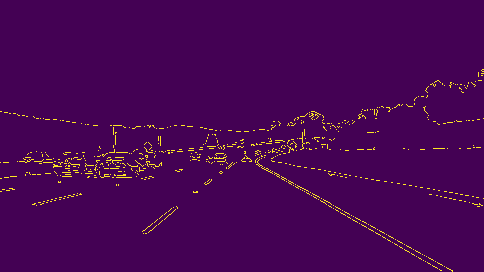
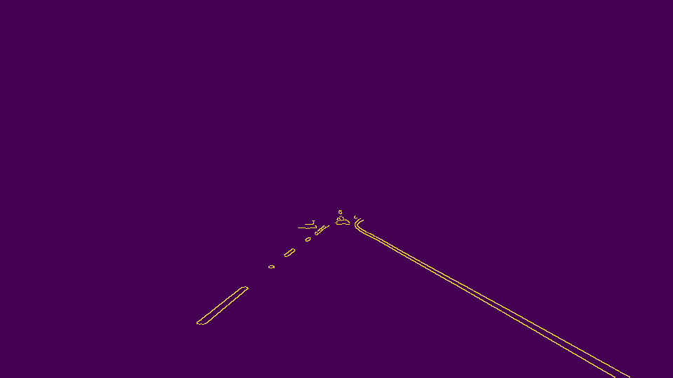
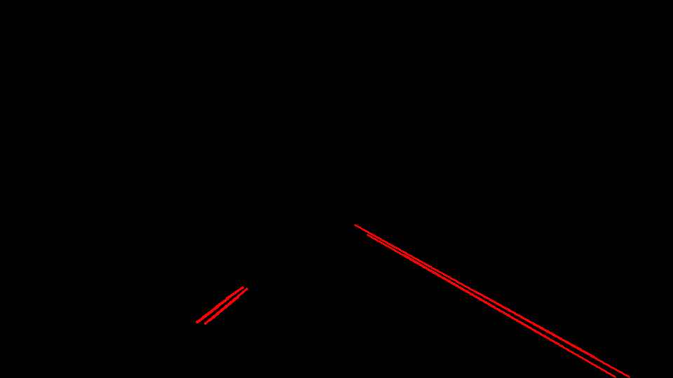
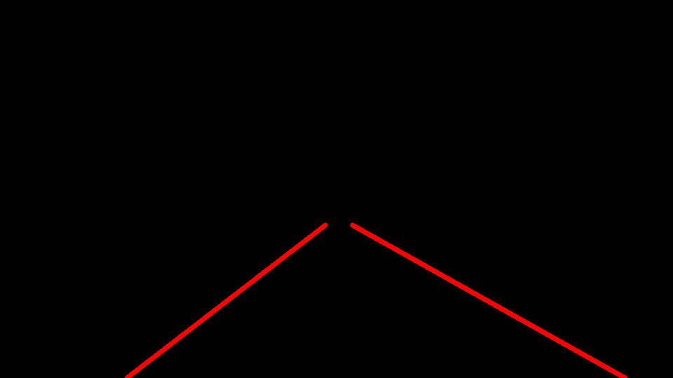
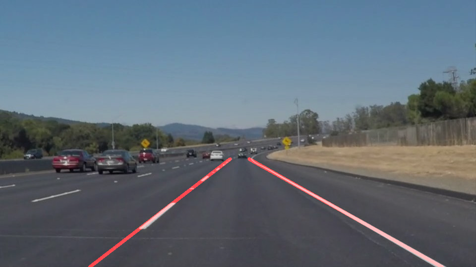

# Finding Lane Lines on the Road

This is a write-up for Project1.

## 1. Pipeline

My pipeline consists of 5 steps:

* Converting an image to grayscale and applying Gaussian smothing on the grayscaled image
* Calling Canny on Gaussian-blured image to detect edges
* Masking the edges image with an interested region
* Applying Hough transformation on the masked edges image to find lines and produce lane lines image through the found lines.
* Combining the lane lines image with the original image

### Converting an image to grayscale and applying Gaussian smothing on the grayscaled image

First I converted an image to grayscale and applied Gaussian smothing on the grayscaled image, so that it is ready for edges detection.

### Calling Canny on Gaussian-blured image to detect edges

Then i called Canny function for the Gaussian-blured image to detect edges. There are 2**8=256 possible pixel values in a grayscaled image. 
So I set high_threshold to 150, which was a value lower than the highest value 255 but it was good enough to represent as a strong gradient between neighbouring pixels.
Meanwhile, I set low_threshold to 50.

### Masking the edges image with interested region

After getting the Gaussian-blured edges image, I masked to obtain the interested region only.

### Applying Hough transformation on the masked edges image to find lines and produce lane lines image through the found lines.

I applied Hough transformation to locate lines in the edges images. I set threshold to 15, so that when there were more than 15 lines in Hough space intersecting at a point, it would be recongized as a line in image space.
I set theta to np.pi/180, so that each point in image space would be mapped to a Hough curve with 360 sampling (p, theta) values. I turned the rest values to find the lines.

I then fed the found lines and a blank image to my function *fit_lane_lines*, which was an enhanced version of the given function *draw_lines*. 
The function first split the given lines into left and right lane points by looking at the line slope, the ones with negative slope belonging to right lane and the rest to left lane.
Then with the two set of points, I utilized *cv2.fitLine* to fit a line out of the given points. Finally i drew the two lane lines on the blank image.

### Combining the lane lines image with the original image

At the last step, I merged the lane line image with the original image to produce a final result.

## 2. Identify potential shortcomings with your current pipeline

* The interested region is hard coded and lane locations are fixed at the moment.
* The fit lane lines are sensitive to noisy points.

## 3. Suggest possible improvements to your pipeline

* The interested region and lane locations could be automatically calculated
* Canny edge detection and Hough transformation parameters could be better turned
* Outlier points could be filtered to make fit lane lines more stable.
